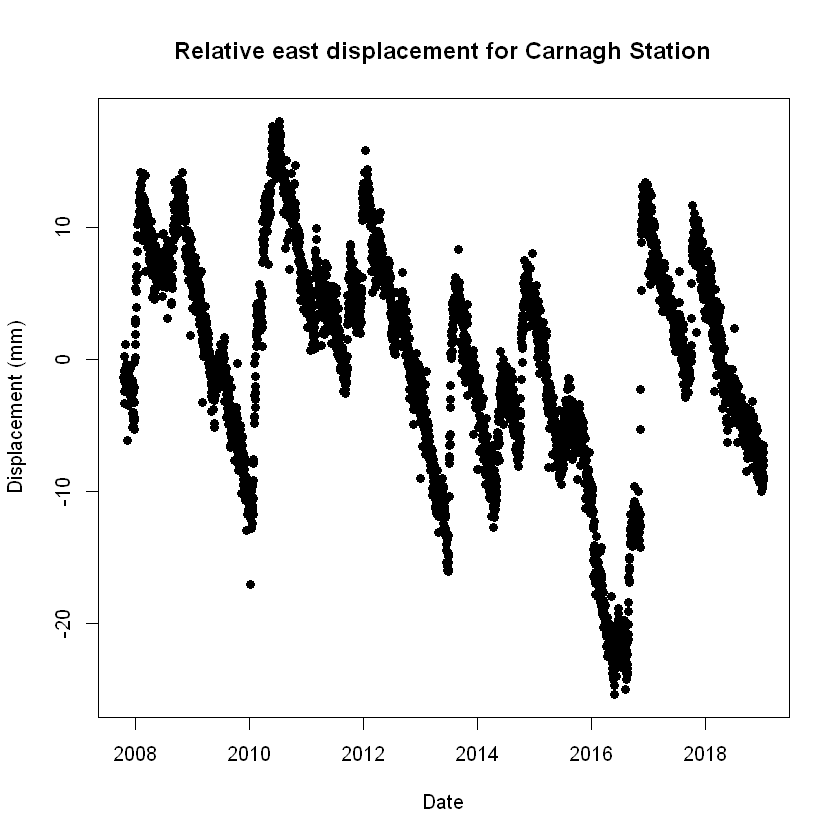

# Accessing GNSS Data in R 
The files in this folders are R notebooks that will demonstrate some simple ways to use the GeoNet FITS API in R.

File Name                     | Description  | Output
----------------------------- | -------------|---------------------------------------
[Introduction_to_GNSS_data_using_FITS_in_R](Introduction_to_GNSS_data_using_FITS_in_R.ipynb)|In this notebook we will learn how to get data from one GNSS station | 
[Multiple_station_access_for_GNSS_data_in_R](Multiple_station_access_for_GNSS_data_in_R.ipynb)|In this notebook we will make a map of GNSS stations in an area then get the data from the station. | 
