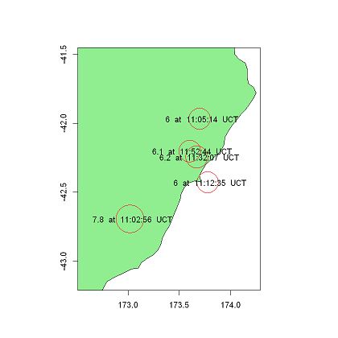
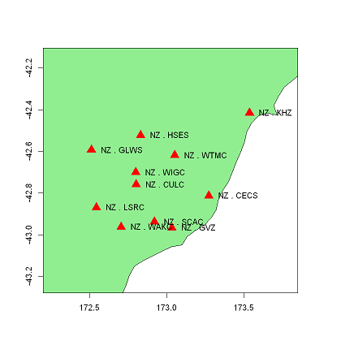
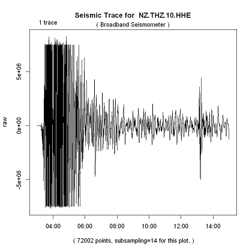

# Accessing Seismic Data in R 
The files in this folders are R notebooks that will demonstrate some simple ways to use the GeoNet FDSN webservices in R.

|File Name                     | Description  | Output|
|----------------------------- | -------------|---------------------------------------|
|[Seismic_data_overview_using_FDSN_in_R](Seismic_data_overview_using_FDSN_in_R.ipynb) | In this tutorial we will look at the work flow from knowing the data of the Seismic Event we wish to look at to getting data on this Seismic Event. We will get a map of Seismic Events, then we will get a station map, and we will get waveform data from one these stations | |
|[Event_Data_using_FDSN_in_R](Event_Data_using_FDSN_in_R.ipynb) |In this tutorial we find all the seismic events that happend in set time. By the end of this notebook you should be able to make a event map like the one.|  |
|[Station_Data_using_FDSN_in_R](Station_Data_using_FDSN_in_R.ipynb) |In this notebook we will look at the station active in a set time frame in a set area. By the end of this tutorial we have a station map like the one below |  |
|[Get_waveform_data_using_FDSN_in_R](Get_waveform_data_using_FDSN_in_R.ipynb)|In this tutorial we will get the wavefrom data from one station. By the end of this notebook you should be able to make a graph like the one. ||
