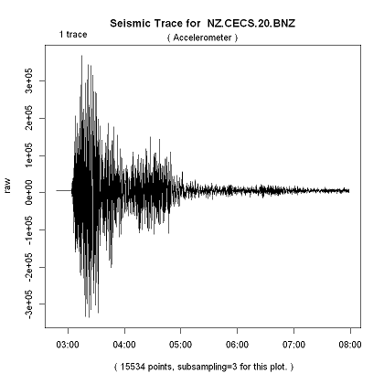

# Accessing Seismic Data in R

File Name                     | Description  | Output
----------------------------- | -------------|---------
Seismic_data_overview_using_FDSN_in_R | In this tutorial we will look at the work flow from knowing the data of the Seismic Event we wish to look at to getting data on this Seismic Event. We will get a map of Seismic Events, then we will get a station map, and we will get waveform data from one these stations |    
