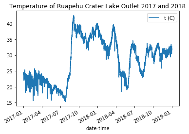
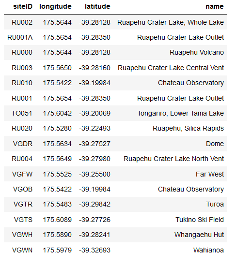
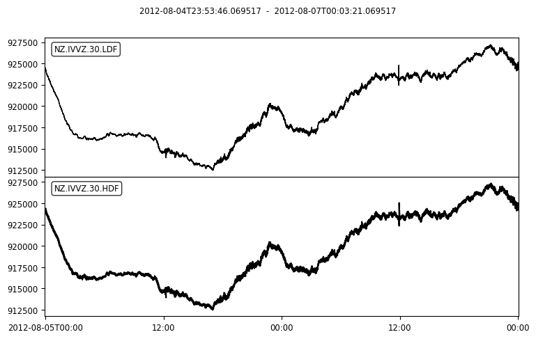
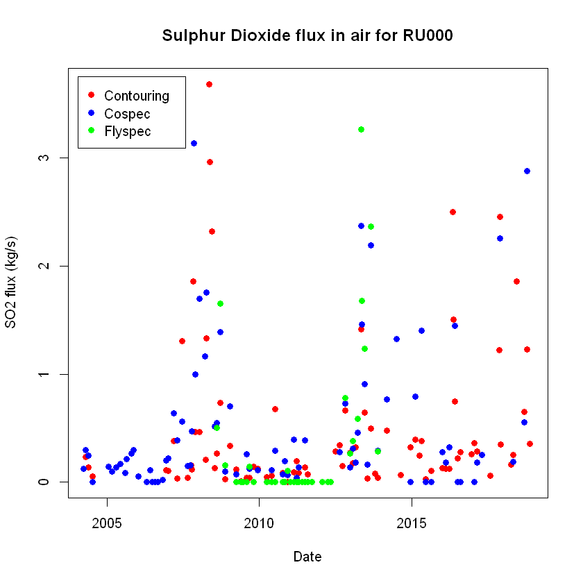
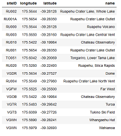

# Volcano Data 

## Accessing Volcaon Data in Python ##
The files in this folders are Python notebooks that will demonstrate some simple ways to access GeoNet volcan data in Python. Please note these examples use Python 3, so the syntax may differ slightly to Python 2.7. We recommend you use Python 3 as it has some important bug fixes.

File Name                     | Description  | Output
----------------------------- | -------------|---------------------------------------
[Volcano Chemistry data using FITS](Python/Volcano_Chemistry_data_using_FITS_in_python.ipynb) | In this notebook we look at getting volcano chemistry data from a set area.|  
[GeoNet's Acoustic Data](Python/GeoNet's_Acoustic_Data.ipynb)|In this tutorial we will look at geting seismic-acoustic waveform data to study volcanic events.| 

## Accessing Volvaon Data in R ##
The files in this folders are R notebooks that will demonstrate some simple ways to use the GeoNet FITS API in R.

File Name                     | Description  | Output
----------------------------- | -------------|---------------------------------------
[Volcano Chemistry data using FITS](R/Volcano_Chemistry_data_using_FITS_in_R.ipynb) | In this notebook we look at getting volcano chemistry data from a set area.|  
